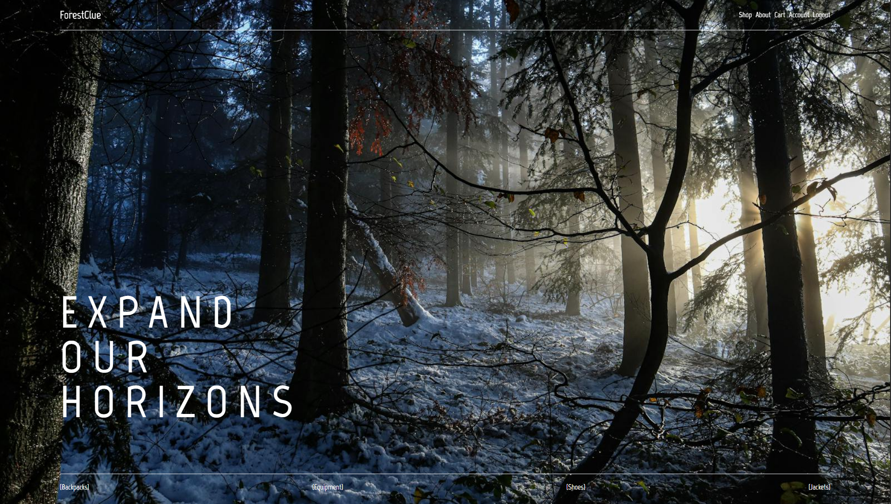
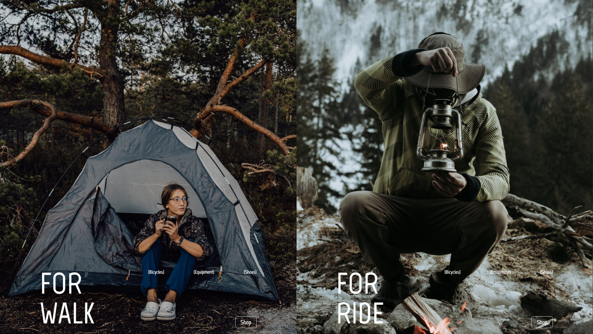
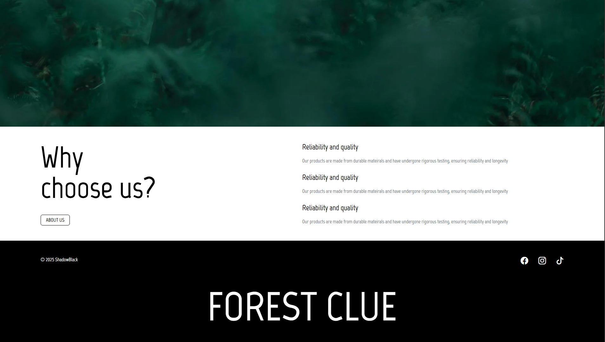
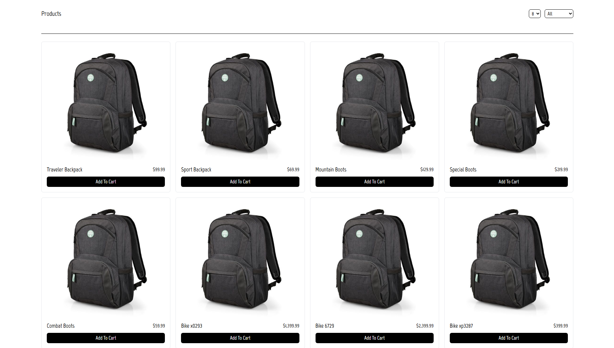
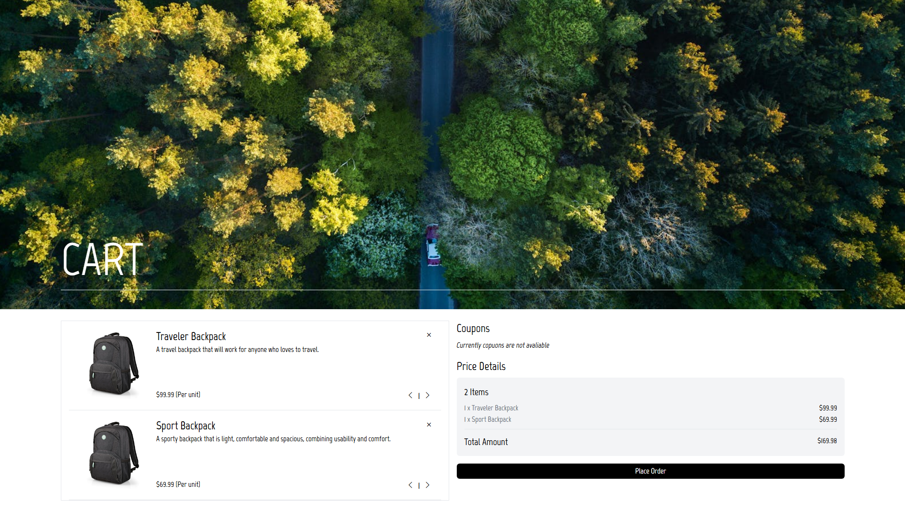
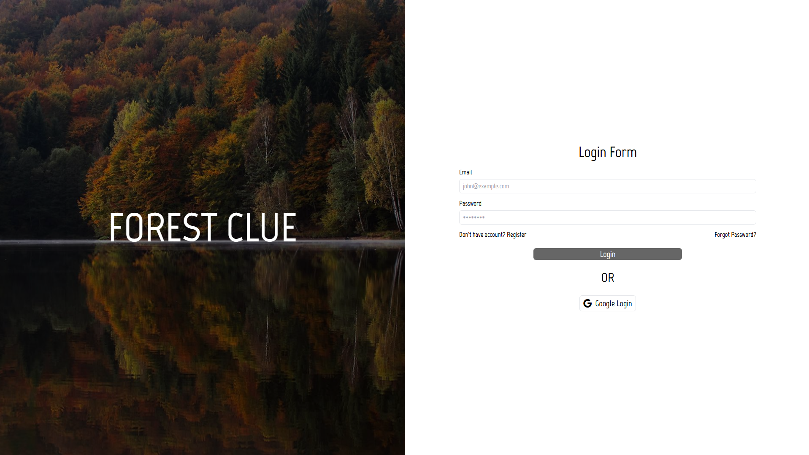

# 💻 ForestClue

Full-Stack E-Commerce project - ForestClue!

## 🛠️ Technologies

- Angular 19
- .NET 9
- TypeScript
- C#
- TailwindCSS
- PostgreSQL
- Stripe
- Docker
- Render.com

## 🎯 Features

- ✅ Home page with description, featured products and animations
- ✅ Advanced Authorization & Authentication (JWT with Refresh Token passed by cookies)
- ✅ OAuth2 (Login via Google)
- ✅ Authentication role-based
- ✅ Products list with possibility to buy
- ✅ Possibility to reset password (Mailing System)
- ✅ Responsive design
- ✅ API Secure
- ✅ Use store tools on frontend (NgRX)
- ✅ Docker
- ✅ Cart logic
- ✅ Advanced architecture of appliaction (Frontend and Backend)
- ✅ Admin dashboard

## 🌐 Demo
- 🔗 [https://forestclue.onrender.com/](https://forestclue.onrender.com/)

## 🧠 Author
- Daniel Miliczek
- GitHub: @ShadowBlack77

## 📸 Screenshots

